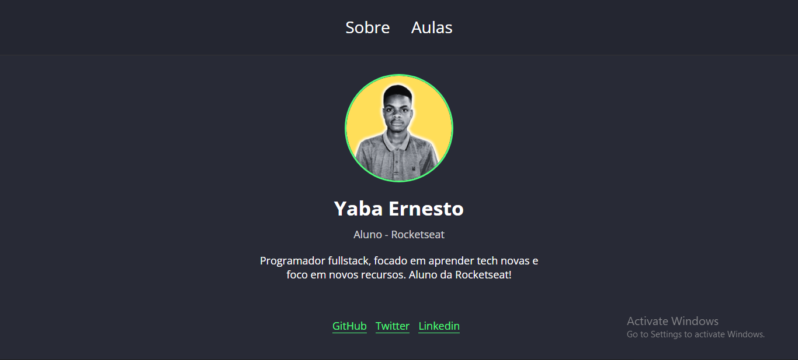

# Portfolio Dinâmico

A fim de um estudo de front e back, um projecto prático para testar ás capacidades a serem prestadas com NodeJS!

## Tecnologias
- HTML5
- CSS3
- JavaScript
- NodeJS
- Express
- Nunjucks
- Git

## Imagens

   
   

